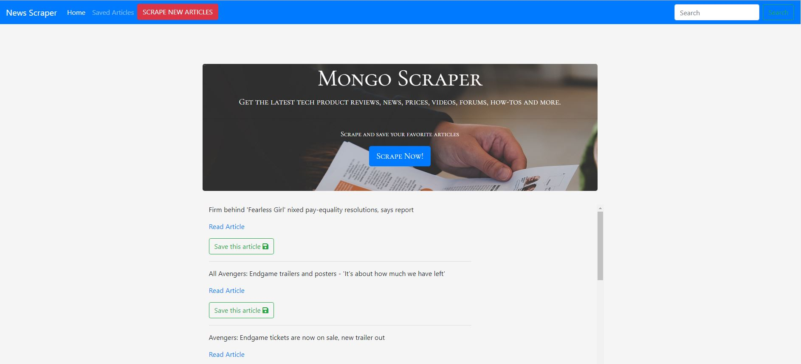
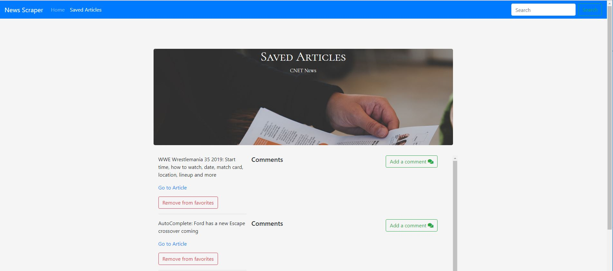
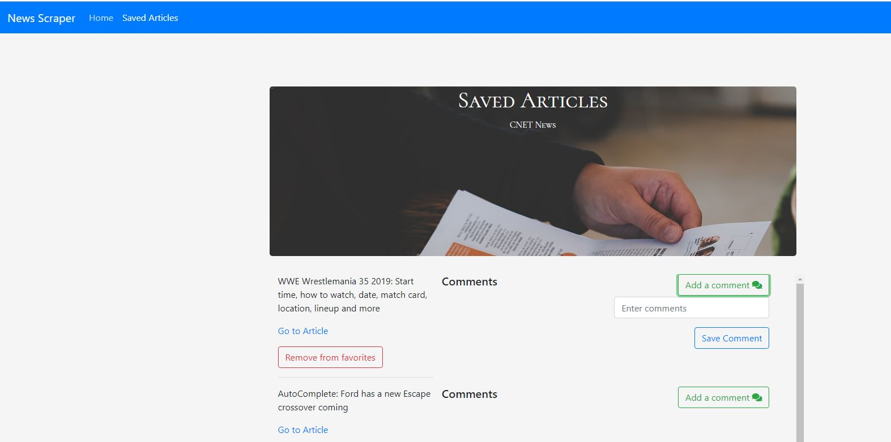

# Paskwa-s-News-Scraper

A full MERN stack web application that allows you to search for news that's relevant for you, mark your favorite stories and add personal notes.

## How it works.
  1. Whenever you visits Paskwa's News Scraper, the app scrapes stories from https://www.cnet.com/news/ and displays them for you. Each scraped article is saved in a MongoDB database. The app then displays the following information for each article:

     * HeadLine - the title of the article
     * URL - the url to the original article

  2. You are able to leave comments on the articles displayed and revisit them later. The comments are saved to the database as well and associated with their articles. If you don't like a comment you made earlier, you'll be able to delete the comment your wrote. All stored comments are visible to every user.

##Screenshots
###Home Page
 

### Saved Articles
 

### Comments
 

## Technology used

   1. express. Express is a light-weight web application framework that I used to organize this web application into an MVC architecture on the server side. It helps me manage everything, from routes, to handling requests and views.

   2. express-handlebars. This is a Handlebars view engine for Express. Handlebars is a lightweight templating system for Node. Handlebars allows us to avoid repetitive code by using templates that are re-usable across many pages.

   3. mongoose. This is the mongoDB ODM for Node.JS. According to Nick Kernick, in [this Medium article,](https://medium.freecodecamp.org/introduction-to-mongoose-for-mongodb-d2a7aa593c57) Mongoose is an Object Data Modeling (ODM) library for MongoDB and Node.js. It manages relationships between data, provides schema validation, and is used to translate between objects in code and the representation of those objects in MongoDB.

   4. cheerio. According to [https://cheerio.js.org/](https://cheerio.js.org/), Cheerio parses markup and provides an API for traversing/manipulating the resulting data structure. It does not interpret the result as a web browser does. Specifically, it does not produce a visual rendering, apply CSS, load external resources, or execute JavaScript.  [article](https://medium.freecodecamp.org/how-to-build-a-simple-search-bot-in-30-minutes-eb56fcedcdb1). [Another article](https:/

   5. axios. [Marlon Bernardes](http://codeheaven.io/how-to-use-axios-as-your-http-client/) describes axios as is a promise-based HTTP client that works both in the browser and in a node.js environment. It provides a single API for dealing with XMLHttpRequests and node’s http interface then wraps the requests using a polyfill for ES6 new’s promise syntax. 

## Demo
The demo of the application can be found here.

## Installation
To run the application locally, first clone this repository with the following command.

git clone https://github.com/pmutunga/PaskwaNewsScraper.  

Next, install the application dependencies.

cd PaskwaNewsScraper and run npm install Finally, run the node server locally.

node server

Now, open the local application on port 3000 at the URL: http://localhost:3000/.

